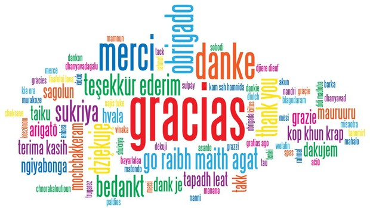

```{r setup, include=FALSE}
knitr::opts_chunk$set(eval = FALSE,
                      message = FALSE,
                      warning = FALSE,
                      fig.align = "center",
                      fig.width = 6,
                      fig.height = 4)
```

# Estadística

## Definición

>Matemática aplicada que permite interactuar con un conjunto de datos, que facilita además las labores de recolección, resumen, comparación y generalización de resultados.


# Conceptos básicos


##
- Población

- Muestra

- Variable

- Individuo


# Tipos de variable

##
- Cualitativas
    - dicotómicas
    - politómica

- Cuantitativas
    - discretas
    - continuas


# Tipos de medida

##
|**Centralización**|**Dispersión**|**Posición**|**Distribución**|
|:---:|:---:|:---:|:---:|
|Media|Desviación estándar|Cuartiles|Asimetría|
|Mediana|Varianza|Deciles|Curtosis|
|Moda|Rango|Percentiles||


# Estadística descriptiva

## 

_Análisis exploratorio_ de datos que proporciona herramientas estadística que permiten la _visualización y representación_ objetiva de la información.


## Objetivos

* Evaluar la calidad y consistencia de los datos.
* Determinar la distribución de las variables en estudio.
* Desplegar posibles patrones de comportamiento de los datos.
* Aplicar el tratamiento de datos ausentes.
* Detectar datos atípicos.
* Comprobar supuestos.
    - **normalidad**
    - **linealidad**
    - **homocedasticidad**
    
# Descripciones usuales

## 

|Escala de medida|Frecuencias|Posición|Dispersión|Distribución|Gráficos|
|:---:|:---:|:---:|:---:|:---:|:---:|
|Normal|Si|Moda|No|No|Barras, pastel|
|Ordinal|Si|Moda|No|No|Barras, áreas, pastel|
|Cuantitativas|No|Media,Moda, Mediana|Si|Si|Histogramas, áreas, dispersión|


# Visualización estática

## `graphics`

```{r, eval=TRUE}
with(cars, scatter.smooth(speed, dist, pch = 18, col = "dodgerblue4",
               lpars = list(col = "red3", lwd = 2)))
grid(col = "gray80")
```

## `lattice`

```{r, eval = TRUE}
library(lattice)
xyplot(dist ~ speed, data = cars, type = c("p", "smooth"), pch = 18,
       grid = TRUE, col = "dodgerblue4", col.line = "red3", lwd = 2)
```

## `ggplot2`

```{r, eval=TRUE}
library(ggplot2)
library(dplyr)
cars %>% 
  ggplot(data = ., aes(x = speed, y = dist)) +
  geom_point(pch = 18, size = 2, color = "dodgerblue4") +
  geom_smooth(se = FALSE, color = "red3", method = "loess", span = 2/3) +
  theme_light()
```

## `ggvis`

<center>
```{r, eval=TRUE}
library(ggvis)
cars %>% 
  ggvis(x = ~speed, y = ~dist) %>%  
  layer_points(shape := "diamond", fill = "dodgerblue4", stroke := "black") %>% 
  layer_smooths(stroke := "firebrick", span = 2/3) %>% 
  hide_legend("fill")
```
</center>

# Visualización interactiva

## `plotly`


<center>
```{r, eval=FALSE}
library(plotly)
cars %>% 
  plot_ly(x = ~speed, y = ~dist, color = I("dodgerblue4"), stroke = I("black"),
          symbol = I("diamond"), type = "scatter") %>% 
  add_lines(y = ~fitted(loess(dist ~ speed, span = 2/3)), color = I("red3")) %>% 
  layout(showlegend = FALSE)
```
</center>

## `dygraphs`

<center>
```{r, eval=FALSE}
library(dygraphs)
lungDeaths <- cbind(mdeaths, fdeaths)
dygraph(lungDeaths)
```
</center>

## `taucharts`

<center>
```{r, eval=FALSE}
devtools::install_github("hrbrmstr/taucharts")
library(taucharts)
CO2 %>%
  tauchart( ) %>%
  tau_point( "conc", c("Treatment","uptake"), "Plant" ) %>%
  tau_tooltip( ) %>%
  tau_trendline( )
```
</center>

## `metricsgraphics`

<center>
```{r, eval=FALSE}
library(metricsgraphics)
mtcars %>%
  mjs_plot(x=wt, y=mpg, width=600, height=500) %>%
  mjs_point(least_squares=TRUE) %>%
  mjs_labs(x="Weight of Car", y="Miles per Gallon")
```
</center>

## `highcharter`

<center>
```{r, eval=FALSE}
library("highcharter")
data(diamonds, mpg, package = "ggplot2")

hchart(mpg, "scatter", hcaes(x = displ, y = hwy, group = class))
```
</center>

## `echarts4r`

<center>
```{r, eval=FALSE}
library(echarts4r)
e1 <- iris %>% 
  group_by(Species) %>% 
  e_charts(
    Sepal.Length,
    elementId = "chart"
  ) %>% 
  e_scatter(Petal.Length, Sepal.Width) %>% 
  e_datazoom(show = FALSE, y_index = 0) %>% 
  e_x_axis(min = 4)
e1
```
</center>

# Recursos

##  
- [`ggvis` RStudio](https://ggvis.rstudio.com/)
- [Plotly R](https://plot.ly/r/)
- [Ejemplos `dygraphs` en Rpubs](https://www.rpubs.com/yoshio/99777)
- [Ejemplos `taucharts`](http://www.buildingwidgets.com/blog/2015/8/5/week-31-taucharts)
- [Ejemplos `metricsgraphics`](http://hrbrmstr.github.io/metricsgraphics/)
- [Ejemplos `highcharter`](http://jkunst.com/highcharter/)
- [Ejemplos `echarts4r`](https://echarts4r.john-coene.com/index.html)


##

```{r, echo=FALSE, eval = TRUE, fig.align = 'center', out.width="500", out.height="500"}

```


